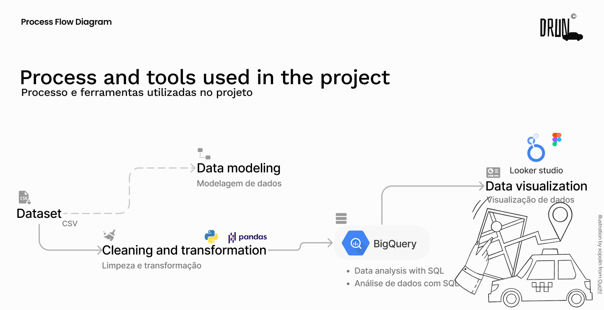
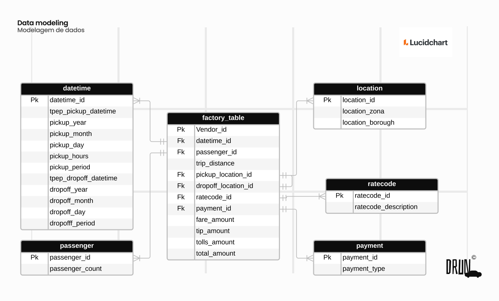

# Pipeline de Dados Drun

Este repositório faz parte do meu projeto pessoal, que tem como objetivo criar um pipeline de dados simples e eficiente. O pipeline envolve várias etapas, incluindo manipulação de dados com a biblioteca Pandas, otimização, transformação, carregamento em um data warehouse e o desenvolvimento de um dashboard interativo.

**Motivação e Contexto do Projeto**: [Leia mais](linkAqui)

**Visualize o Dashboard**: [Acesse o Dashboard](linkAqui)

## Estrutura do Repositório

O repositório está organizado em várias pastas, cada uma desempenhando um papel importante no pipeline de dados:

### 1. Pasta "data_transformation"

- **main.py**: Este arquivo contém o código responsável pelo carregamento dos dados, otimização e transformação do modelo conceitual em um modelo físico. É um processo de engenharia de dados.

- **connector.py**: Aqui, você encontrará todas as configurações de conexão necessárias para se conectar ao data warehouse(Google BigQuery).

### 2. Pasta "query_database"

- **query_join.sql**: Este arquivo contém o código SQL utilizado no Google BigQuery para criação da nova tabela de análises. Preparação dos dados para análises e uso no Looker Studio.

### 3. Pasta "data"

- Nesta pasta, você encontrará todos os datasets que foram limpos e preparados. Esses datasets são a matéria-prima para análises futuras e o dashboard.

### 4. Pasta "analysis"

- Aqui, você encontrará um notebook que realizam análises preliminares dos dados. Essa análises foi útil para entender melhor os dados antes de criar o dashboard final.

Veja mais projetos [Link para o repositório](https://github.com/kauanmaia01)

Este projeto demonstra um processo de engenharia de dados completo, desde a preparação dos dados até a análise e apresentação dos resultados por meio de um dashboard interativo.

Muito obrigado pela atenção!
